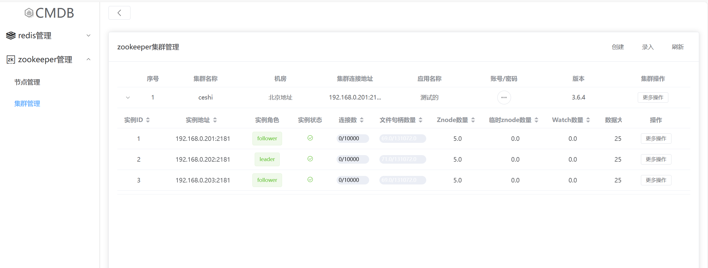
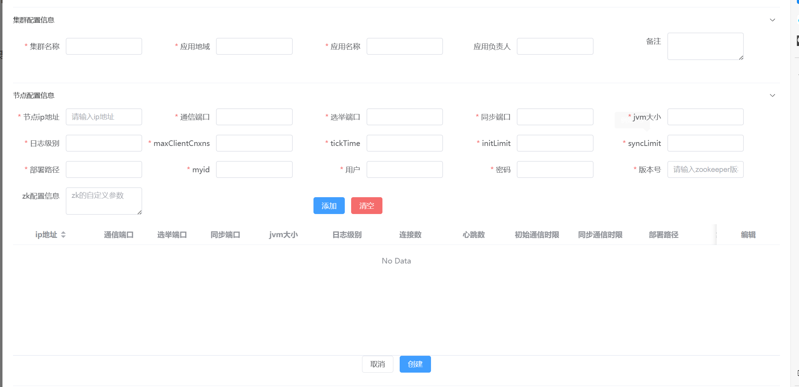
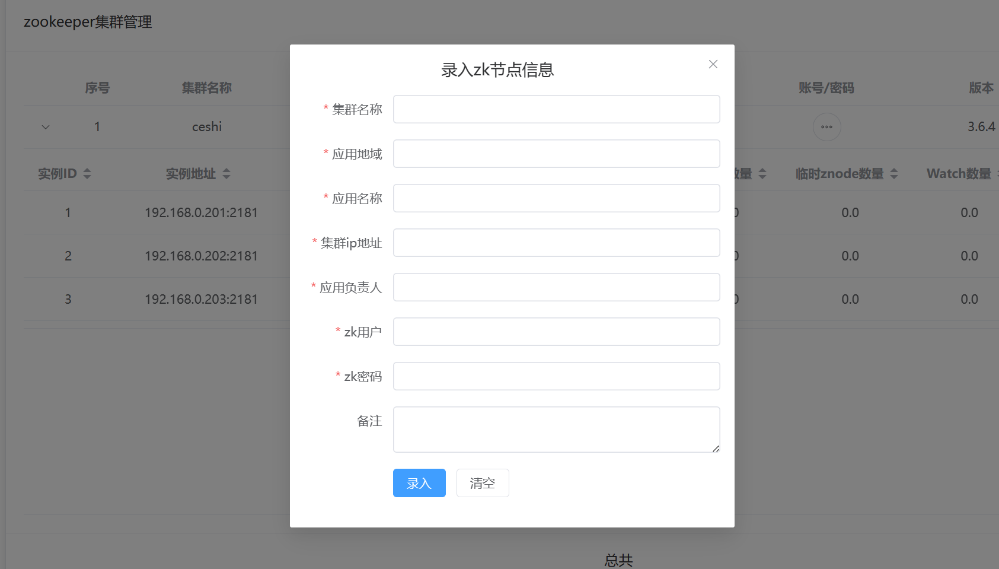

# cmdb

#### 介绍

cmdb 管理

#### 软件架构

采用 nignx+server+agent+mysql 的方式

#### 安装教程

1.  web 安装

```shell
# 首先进行安装nginx
yum install -y epel-release
yum install -y nginx
# 进行启动nginx
systemctl start nginx
# 修改nginx的配置文件
vim /etc/nginx/conf.d/default.conf
# 下面是修改后的结果
server {
    listen       80;
    server_name  62.234.1.167;

    #access_log  /var/log/nginx/host.access.log  main;

    location / {
        root   /usr/share/nginx/html/dist;
	index  index.html index.htm;
	try_files $uri $uri/ /index.html;
    }
    location /assets {
        root   /usr/share/nginx/html/dist/;
    }
    location /api {
        proxy_set_header Host $host:$server_port;
        proxy_set_header X-Real-IP $remote_addr;
        proxy_set_header X-Real-PORT $remote_port;
        proxy_set_header X-Forwarded-For $proxy_add_x_forwarded_for;
        proxy_pass http://127.0.0.1:81/api;
    }
}
```

2.  开始进行编译静态文件

```shell
npm run build:porc
```

### 页面的展示：

#### zookeeper 管理

1. zookeeper 管理页面
   
2. 自动部署页面
   
3. 录入集群页面
   

#### redis 管理
